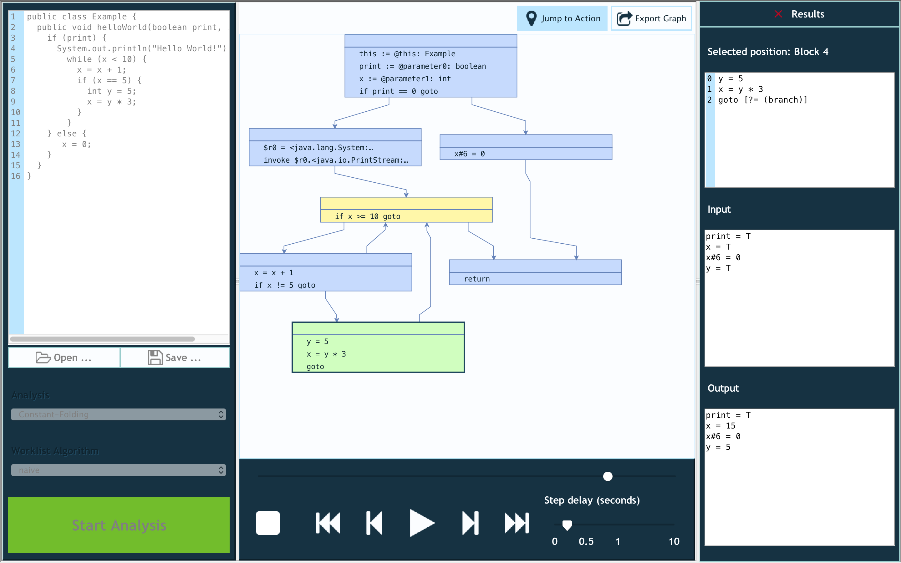

# VisualDFA

VisualDFA is a sophisticated educational tool for interactively visualizing data-flow analyses using Java/Jimple.

## About

Data-flow analyses such as Constant Folding are an important part of modern compilers, helping them to optimize code for performance. 
Compilers are usually black boxes that take source code and produce optimized binaries.
VisualDFA aims to step in between, making data-flow analyses interactive and fun to understand.

VisualDFA was drafted and created by an amazing team of **five students at Karlsruhe Institute of Technology** (Germany).
**[Click here to learn more about the authors!](AUTHORS.md)**

## Features

VisualDFA enables you to:

- Run four built-in analyses: Constant Folding, Constant Bits, Reaching Definitions, Taint Analysis
- Enter Java code, or load it from a file
- Visualize the code using a control flow graph (CFG)
- Click through an analysis step by step, or auto-run an analysis until it hits a set breakpoint
- See in and out states for any basic block or line of code, anytime
- Export the current control flow graph as PNG, or perform a batch export of all analysis steps
- Implement and run custom analyses, without having to recompile VisualDFA

## Installation And First Use

0. Make sure you have JDK 1.7 installed.
1. Download the latest release from [here](https://github.com/ppati000/visualDFA/releases).
2. Unpack the ZIP file and run the JAR file found inside.
3. You will be greeted with a dialog to select the directory of your **JRE located inside your JDK**, e.g. `[...]jdk1.7.0_80.jdk/Contents/Home/jre`.
   Make sure **not** to select a JRE directory which is not inside a JDK directory. This will render VisualDFA unusable as it cannot access `javac`.
4. Take the example code or edit it, then select your favorite analysis and click "Start Analysis".
5. In the popup which appears, select the method you would like to analyze.
6. Congratulations! You should now see a CFG and can freely navigate through the steps of the analysis using the bottom bar's buttons or slider.

## Advanced Instructions

- If an analysis is active, you can control which in and out states you would like to see: 
  If "Jump to Action" (at the top right of the CFG) is enabled, you will always see the state of the currently inspected block or line.
  Else, you can manually select blocks or lines to show their states by clicking them.

- To auto-run the analysis, you can set a step delay in the bottom bar, then hit the Play ▶️ button.

- To set or unset a breakpoint in a code line inside the CFG, click the very left part of the line.

- To export your CFG as a PNG image, click the "Export Graph" button. Then, you can specify the resolution and type of export (batch export of all analysis steps or current graph only)

An even more detailed manual (German) is part of the downloaded ZIP file.

## Implementing Custom Analyses

Please see `Analysis-Guide.pdf` in the downloaded ZIP file for a guide on how to implement your own data-flow analysis.

## License And Contributing

VisualDFA is released under the MIT License. Please note that the main application code sits in `/Implementierung/visual-dfa/`.

**Any contributions** to VisualDFA are welcome! This includes not only features/new analyses/bug fixes, but also:

- Documentation about how to use, modify or customize the main application or analyses
- Finding and reporting bugs or problems using GitHub Issues
- Extending existing JUnit tests, or adding new ones

For a contribution containing new application code, please do the following if you would like it to be merged:

0. If you plan a major update, feel free to contact one of the [authors](AUTHORS.md) first.
1. Fork this repository.
2. Write your new code. Please include unit tests for new stuff, and make sure all existing tests still pass.
3. Create a pull request.
